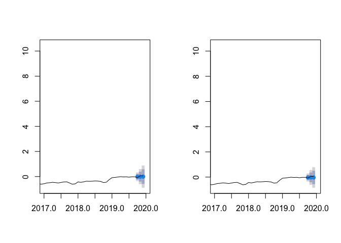
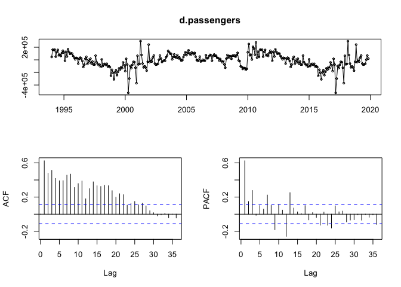
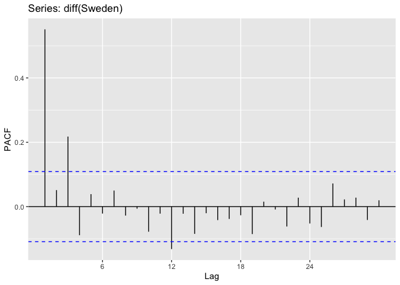
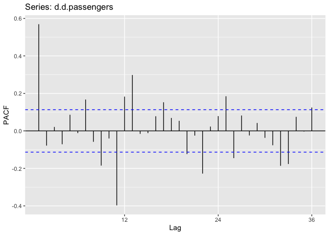
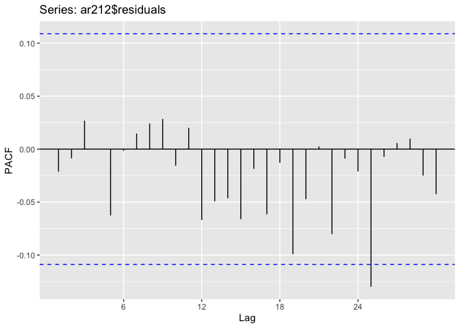
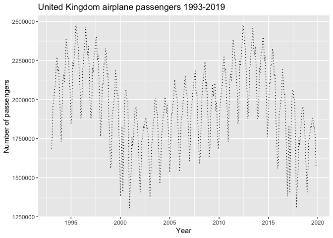
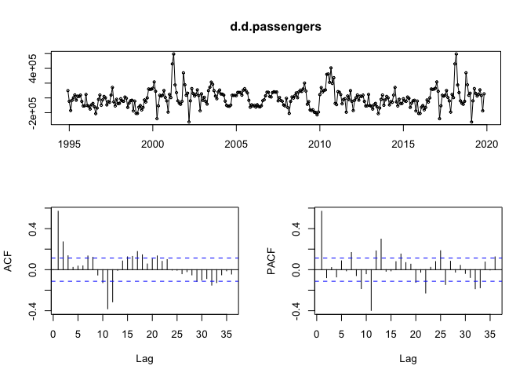
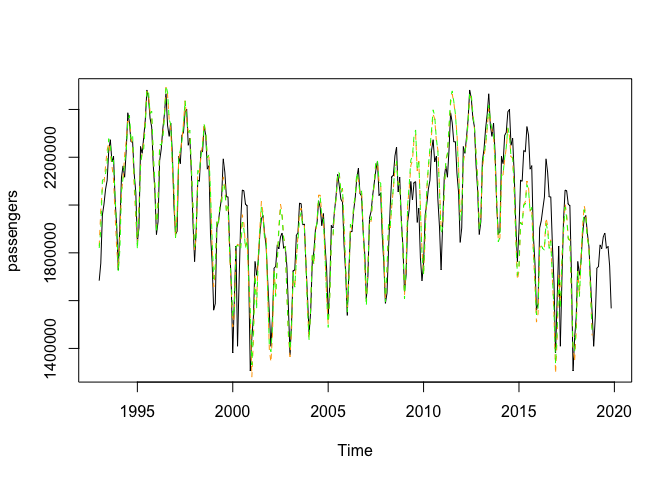

# ARIMA model

### 1. Data description

##### Provided data shows the Price Index of goods and services in Poland between the years 2000 and 2020. The basic prices value reflects December of 1999 and is set as a 100, so basically, every record is a mean value of selected month’s prices in goods and services divided by the mean value of this sector’s prices in December 1999 and multiplied by 100.


```r
library(readxl)
prices_data <- read_excel("Szereg_niesezon.xls")

prices= ts(data=prices_data$TOWARYUSLUGI, frequency = 12,             
             start=c(2000,1), end=c(2020,2)) 
```

<!-- --><!-- -->

##### According to initial plots, however, this particular time series seems to be non-stationary, the first differences could be. Therefore I will examine that by the Dickey-Fuller test.

### 2. Integration level


```r
testdf(prices, 4)
```

```
##   order        adf  p_adf     bgodfrey         p_bg
## 2     0 -1.5158040 >10pct 41.047902309 1.485435e-10
## 3     1 -0.8876064 >10pct  0.084735842 7.709793e-01
## 4     2 -0.8403187 >10pct  0.001270835 9.715624e-01
## 5     3 -0.9455180 >10pct  0.011121492 9.160120e-01
## 6     4 -0.7234465 >10pct  0.012347195 9.115228e-01
```

##### Analysis of original time series has proven, that according to the Dickey-Fuller Test, it is not stationary (p-value > 10 percent), that proves visual conclusion. What is more, according to the Breusch-Godfrey test with no lags, the null hypothesis about no autocorrelation of residuals is rejected.

```
##   order       adf p_adf    bgodfrey      p_bg
## 2     0 -9.826651 <1pct 0.064594667 0.7993760
## 3     1 -8.661916 <1pct 0.001019372 0.9745298
## 4     2 -7.813271 <1pct 0.009423747 0.9226661
## 5     3 -6.340606 <1pct 0.010535084 0.9182483
## 6     4 -6.624976 <1pct 0.091552226 0.7622130
```

##### Statistical tests of first differences of selected time series prove, that according to Dickey-Fuller test, we cannot reject the null hypothesis of non-stationarity (p-value < 1 percent), and by p-value = 0.7993760 of Breusch-Godfrey test, there is no autocorrelation between residuals in this model


```r
ggAcf(diff(prices), lag.max = 30)
```

<!-- -->

##### Although using the AutoCorrelation Function, we can spot a seasonality in this time series. This conjecture is proven by W-O test (Webel Ollech)


```r
library(seastests)
summary(wo(prices))
```

```
## Test used:  WO 
##  
## Test statistic:  1 
## P-value:  1.666778e-12 4.599153e-10 4.773959e-15 
##  
## The WO - test identifies seasonality
```

# Second ARIMA model

##### As the first task was to analyze the non-seasonal time series, we need to change data. Therefore I will use a monthly mean of 3-month interest rate in Sweden. Time series comes from the Eurostat database.


```r
library(readr)
IR <- read_delim("IR.csv", ",", escape_double = FALSE, 
                    trim_ws = TRUE)
```

```
## Parsed with column specification:
## cols(
##   TIME = col_character(),
##   GEO = col_character(),
##   S_ADJ = col_character(),
##   P_ADJ = col_character(),
##   INDIC = col_character(),
##   Value = col_double(),
##   `Flag and Footnotes` = col_logical()
## )
```

```r
Sweden= ts(data=IR$Value, frequency = 12,             
           start=c(1993,1), end=c(2019,12)) 
```
<!-- --><!-- -->

```
## Test used:  WO 
##  
## Test statistic:  0 
## P-value:  1 1 0.8918526 
##  
## The WO - test does not identify  seasonality
```

##### We can spot no seasonality by W-O test. Therefore we initiate ARIMA model analysis.

### 2.1 Integration level


```r
testdf(Sweden,4)
```

```
##   order       adf  p_adf    bgodfrey         p_bg
## 2     0 -3.179772  <5pct 96.53549739 8.765804e-23
## 3     1 -2.169803 >10pct  0.03504696 8.514973e-01
## 4     2 -2.439671 >10pct  0.03997574 8.415280e-01
## 5     3 -2.467527 >10pct  0.11926454 7.298335e-01
## 6     4 -1.832769 >10pct  0.07683363 7.816351e-01
```

##### Despite stationarity reported by the Dickey-Fuller test in the original time series, we cannot rely on that test, because autocorrelation between residuals has been spotted by the Breusch-Godfrey test and that violates assumptions of Dickey-Fuller test.

```r
testdf(diff(Sweden),4)
```

```
##   order       adf p_adf     bgodfrey      p_bg
## 2     0 -9.770692 <1pct 0.0423442145 0.8369650
## 3     1 -8.006240 <1pct 0.0265402993 0.8705878
## 4     2 -5.836524 <1pct 0.0696725564 0.7918141
## 5     3 -6.462094 <1pct 0.0539899749 0.8162604
## 6     4 -5.749978 <1pct 0.0009232136 0.9757605
```

##### Using the first differences of Sweden interest rates time series, with p-value = 0.8369650 we don't reject the null hypothesis of no autocorrelation between residuals and reject the null hypothesis of Dickey-Fuller test (p-value < 1percent) about non-stationarity of time series. Therefore we conclude, that the first differences are a stationary time series. We will confirm that using Kwiatkowski-Phillips-Schmidt-Shin test (KPSS)


```r
library(tseries)
kpss.test(diff(Sweden))
```

```
## Warning in kpss.test(diff(Sweden)): p-value greater than printed p-value
```

```
## 
## 	KPSS Test for Level Stationarity
## 
## data:  diff(Sweden)
## KPSS Level = 0.18489, Truncation lag parameter = 5, p-value = 0.1
```

##### By not rejecting the null hypothesis of KPSS test with p-value = 0.1, we confirm stationarity of first differences
  
### 2.2 Parameters p and q identification


```r
ggAcf(diff(Sweden), lag.max = 30)
```

<!-- -->

```r
ggPacf(diff(Sweden), lag.max = 30)
```

<!-- -->

##### Auto Correlation Function suggests Moving Average with q parameter = 7, and Partial Auto Correlation Function suggests p = 3. In consequence, we will analyze maximal model ARIMA(3,1,7) and respectively lower parameters.


```r
ar317 <- Arima(Sweden, order  = c(3,1,7))
ar316 <- Arima(Sweden, order  = c(3,1,6))
ar315 <- Arima(Sweden, order  = c(3,1,5))
ar314 <- Arima(Sweden, order  = c(3,1,4))
ar313 <- Arima(Sweden, order  = c(3,1,3))
ar312 <- Arima(Sweden, order  = c(3,1,2))
ar311 <- Arima(Sweden, order  = c(3,1,1))
ar310 <- Arima(Sweden, order  = c(3,1,0))

ar217 <- Arima(Sweden, order  = c(2,1,7))
ar216 <- Arima(Sweden, order  = c(2,1,6))
ar215 <- Arima(Sweden, order  = c(2,1,5))
ar214 <- Arima(Sweden, order  = c(2,1,4))
ar213 <- Arima(Sweden, order  = c(2,1,3))
ar212 <- Arima(Sweden, order  = c(2,1,2))
ar211 <- Arima(Sweden, order  = c(2,1,1))
ar210 <- Arima(Sweden, order  = c(2,1,0))

ar117 <- Arima(Sweden, order  = c(1,1,7))
ar116 <- Arima(Sweden, order  = c(1,1,6))
ar115 <- Arima(Sweden, order  = c(1,1,5))
ar114 <- Arima(Sweden, order  = c(1,1,4))
ar113 <- Arima(Sweden, order  = c(1,1,3))
ar112 <- Arima(Sweden, order  = c(1,1,2))
ar111 <- Arima(Sweden, order  = c(1,1,1))
ar110 <- Arima(Sweden, order  = c(1,1,0))

ar017 <- Arima(Sweden, order  = c(0,1,7))
ar016 <- Arima(Sweden, order  = c(0,1,6))
ar015 <- Arima(Sweden, order  = c(0,1,5))
ar014 <- Arima(Sweden, order  = c(0,1,4))
ar013 <- Arima(Sweden, order  = c(0,1,3))
ar012 <- Arima(Sweden, order  = c(0,1,2))
ar011 <- Arima(Sweden, order  = c(0,1,1))
ar010 <- Arima(Sweden, order  = c(0,1,0))
```

##### Now we need to find the best fitted ARIMA model, by the values of Akaike and Bayesian Information Criterion


```r
aic <- AIC(ar317,ar316,ar315,ar314,ar313,ar312,ar311,ar310, ar217,ar216,ar215,ar214,ar213,ar212,ar211,ar210,ar117,ar116,ar115,ar114,ar113,ar112,ar111,ar110,ar017,ar016,ar015,ar014,ar013,ar012,ar011,ar010 )
head(aic[order(aic$AIC),c(1,2)])
```

```
##       df       AIC
## ar212  5 -256.8272
## ar213  6 -254.9639
## ar113  5 -254.9624
## ar312  6 -254.9102
## ar311  5 -254.8783
## ar114  6 -254.5486
```

```r
bic <- BIC(ar317,ar316,ar315,ar314,ar313,ar312,ar311,ar310, ar217,ar216,ar215,ar214,ar213,ar212,ar211,ar210,ar117,ar116,ar115,ar114,ar113,ar112,ar111,ar110,ar017,ar016,ar015,ar014,ar013,ar012,ar011,ar010 )
head(bic[order(bic$BIC),c(1,2)])
```

```
##       df       BIC
## ar310  4 -239.3799
## ar212  5 -237.9389
## ar113  5 -236.0741
## ar311  5 -235.9900
## ar112  4 -233.7282
## ar110  2 -233.0761
```

##### As the ar212 is the best ARIMA model by the Akaike criterion, and second-best with BIC, we can assume that's the best-suited model for this time series. Therefore we need to check if it's residuals can be classified as a White Noise


```r
ggAcf(ar212$residuals, lag.max = 30)
```

<!-- -->

```r
ggPacf(ar212$residuals, lag.max = 30)
```

<!-- -->

```r
Box.test(ar212$residuals, type = "Ljung-Box", lag = 25)
```

```
## 
## 	Box-Ljung test
## 
## data:  ar212$residuals
## X-squared = 18.113, df = 25, p-value = 0.8375
```

##### According to visual analysis and Ljung-Box test, there are no other lags and the model's residuals can be classified as a White Noise (p-value = 0.8375). 

### 2.3 Prediction of the last three periods
##### As the ARIMA model contains trend, and no seasonality was detected, we can use Holt method in order to predict future values. the prediction will be examined by comparison with ARIMA forecast from forecast library.
<!-- -->

##### The plot on the left presents prediction of last three period's values generated by Holt method (represented by blue dots) and the real values (black line) of time series, while the plot on the right compares ARIMA forecast with real values. Predictions on both models looks close to the real values, so we will examine their precision by MAE, MSE, MAPE and SMAPE statistics


```
##                [,1]      [,2]      [,3]      [,4]     
## stats          "MAE"     "MSE"     "MAPE"    "SMAPE"  
## Holt_stats     "0.05953" "0.00356" "1.01419" "1.76925"
## forecast_stats "0.0678"  "0.00509" "1.18406" "1.57853"
```

##### Prediction provided by Holt's method generates smaller Mean Absolute Error, Mean Squared Error and Mean Absolute Percentage Error than ARIMA model, but is a worse prediction according to Symmetric Mean Absolute Percentage Error Statistics

# SARIMA model

### 3.1. Data description

##### Provided data is a monthly amount of airplane passengers in United Kingdom between years 1993 and 2019. Data originate from Eurostat database and used variable is Passengers carried, so it reports sum of people on board of an flights, that originated or destinated in United Kingdom in reported month 


```
## Warning: Ignoring unknown parameters: ts.colour
```

<!-- -->

##### The plot above represents values of analysed time series. Clearly there exist some seasonality, and definitely there is no stationarity in this time series. Therefore, twelveth differences are used to continue analysis. 

<!-- -->

##### After using 12th difference, seasonality is hardly spotted, but as the time series is still non - stationary, I use first differences

<!-- -->

```
##   order       adf p_adf    bgodfrey      p_bg
## 2     0 -9.034743 <1pct 0.727787648 0.3936012
## 3     1 -8.636634 <1pct 0.001520651 0.9688940
## 4     2 -7.529352 <1pct 0.005544603 0.9406427
## 5     3 -7.359737 <1pct 0.010157447 0.9197218
```

```
## Warning in kpss.test(d.d.passengers): p-value greater than printed p-value
```

```
## 
## 	KPSS Test for Level Stationarity
## 
## data:  d.d.passengers
## KPSS Level = 0.11477, Truncation lag parameter = 5, p-value = 0.1
```

##### After using another differencing, time series seems to be stationary, so with usage of Dickey-Fuller test and KPSS test, stationarity is proven. With Breusch-Godfrey test assuring about no autocorrelation of residuals, stationarity is proven by p-value <1 percent of Augmented Dickey-Fuller test. What is more, Kwiatkowski-Phillips-Schmidt-Shin test, with p-value = 0.1, does not reject null hypothesis of stationarity of time series. 

<!-- -->

##### By analysis of 12th lags of AutoCorrelation Function, we can spot promptly descending correlation, so P parameter in seasonal AR model is recognised as 1. By analysis of firs lags, we can spot three significant lags, then p parameter equal to 3 in non-seasonal Auto Regressive model will be considered

<!-- -->

##### As a result of Partial AutoCorrelation Function analysis, seasonal Moving Average parameter Q is recognised as 1, and non-seasonal MA parameter is pointed out as 2, 3 or 8. 
