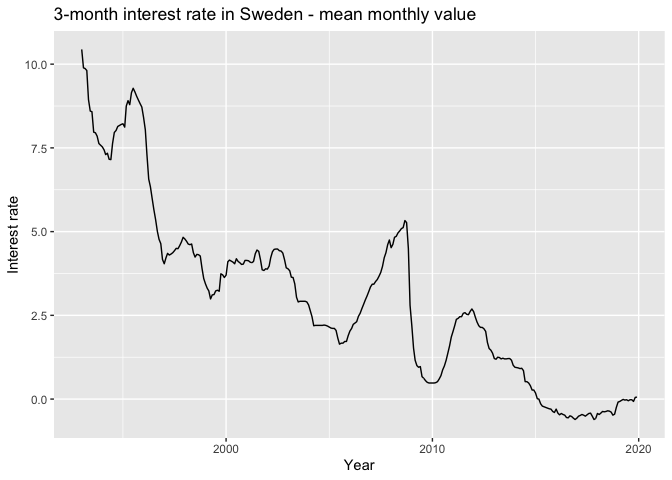
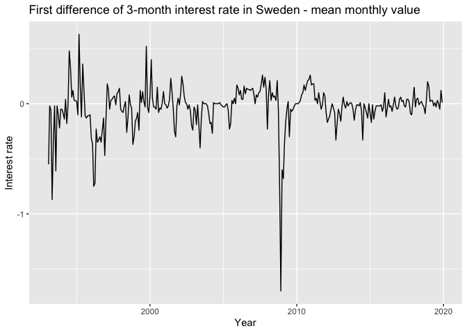
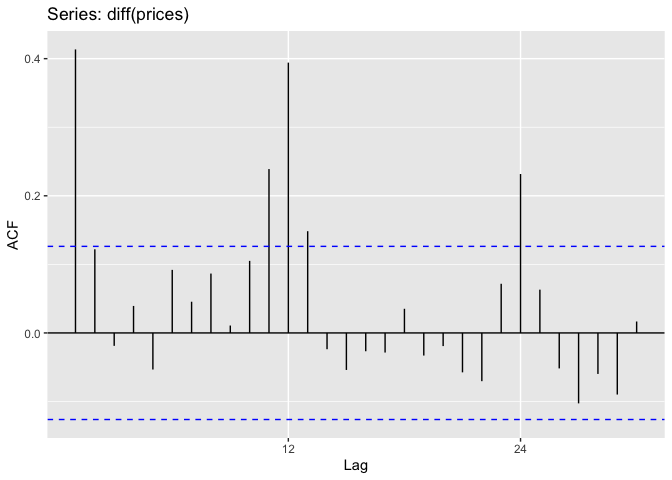

# ARIMA model

### 1. Data description
Provided data shows the Price Index of goods and services in Poland between the years 2000 and 2020. The basic prices value reflects December of 1999 and is set as a 100, so basically, every record is a mean value of selected month’s prices in goods and services divided by the mean value of this sector’s prices in December 1999 and multiplied by 100.


```r
library(readxl)
prices_data <- read_excel("Szereg_niesezon.xls")

prices= ts(data=prices_data$TOWARYUSLUGI, frequency = 12,             
             start=c(2000,1), end=c(2020,2)) 
```

<!-- --><!-- -->

According to initial plots, however, this particular time series seems to be non-stationary, the first differences could be. Therefore I will examine that by the Dickey-Fuller test.

### 2. Integration level


```r
testdf(prices, 4)
```

```
##   order        adf  p_adf     bgodfrey         p_bg
## 2     0 -1.5158040 >10pct 41.047902309 1.485435e-10
## 3     1 -0.8876064 >10pct  0.084735842 7.709793e-01
## 4     2 -0.8403187 >10pct  0.001270835 9.715624e-01
## 5     3 -0.9455180 >10pct  0.011121492 9.160120e-01
## 6     4 -0.7234465 >10pct  0.012347195 9.115228e-01
```

Analysis of original time series has proven, that according to the Dickey-Fuller Test, it is not stationary (p-value > 10 percent), that proves visual conclusion. What is more, according to the Breusch-Godfrey test with no lags, the null hypothesis about no autocorrelation of residuals is rejected.

```
##   order       adf p_adf    bgodfrey      p_bg
## 2     0 -9.826651 <1pct 0.064594667 0.7993760
## 3     1 -8.661916 <1pct 0.001019372 0.9745298
## 4     2 -7.813271 <1pct 0.009423747 0.9226661
## 5     3 -6.340606 <1pct 0.010535084 0.9182483
## 6     4 -6.624976 <1pct 0.091552226 0.7622130
```

Statistical tests of first differences of selected time series prove, that according to Dickey-Fuller test, we cannot reject the null hypothesis of non-stationarity (p-value < 1 percent), and by p-value = 0.7993760 of Breusch-Godfrey test, there is no autocorrelation between residuals in this model


```r
ggAcf(diff(prices), lag.max = 30)
```

<!-- -->

Although using the AutoCorrelation Function, we can spot a seasonality in this time series. This conjecture is proven by W-O test (Webel Ollech)


```r
library(seastests)
summary(wo(prices))
```

```
## Test used:  WO 
##  
## Test statistic:  1 
## P-value:  1.666778e-12 4.599153e-10 4.773959e-15 
##  
## The WO - test identifies seasonality
```

T
