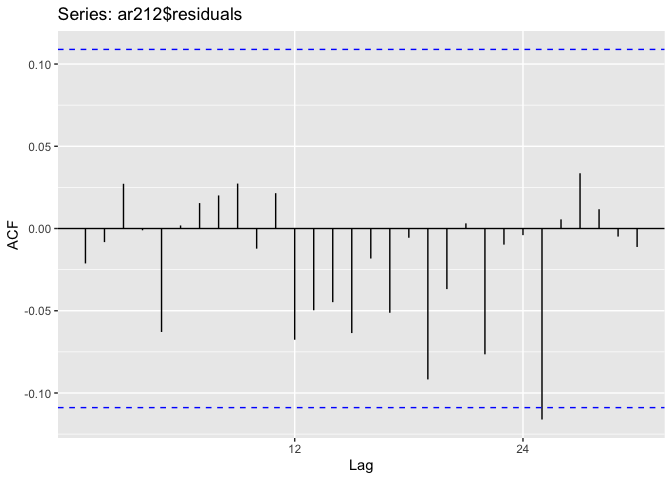

##Oświadczenie autora pracy
###Świadom(a) odpowiedzialności prawnej oświadczam, że niniejsza praca została napisana samodzielnie i nie zawiera treści uzyskanych w sposób niezgodny z obowiązującymi przepisami.
###Oświadczam ponadto, że niniejsza wersja pracy jest identyczna z załączoną wersją elektroniczną.
###Data: 9.06.2020 Podpis autora pracy Jan Dudzik


# ARIMA model

##### As the first task was to analyze the non-seasonal time series, we need to change data. Therefore I will use a monthly mean of 3-month interest rate in Sweden. Time series comes from the Eurostat database.


```
## Registered S3 method overwritten by 'quantmod':
##   method            from
##   as.zoo.data.frame zoo
```

```
## Registered S3 methods overwritten by 'ggfortify':
##   method                 from    
##   autoplot.Arima         forecast
##   autoplot.acf           forecast
##   autoplot.ar            forecast
##   autoplot.bats          forecast
##   autoplot.decomposed.ts forecast
##   autoplot.ets           forecast
##   autoplot.forecast      forecast
##   autoplot.stl           forecast
##   autoplot.ts            forecast
##   fitted.ar              forecast
##   fortify.ts             forecast
##   residuals.ar           forecast
```

```
## Parsed with column specification:
## cols(
##   TIME = col_character(),
##   GEO = col_character(),
##   S_ADJ = col_character(),
##   P_ADJ = col_character(),
##   INDIC = col_character(),
##   Value = col_double(),
##   `Flag and Footnotes` = col_logical()
## )
```
<!-- --><!-- -->

```
## Test used:  WO 
##  
## Test statistic:  0 
## P-value:  1 1 0.8918526 
##  
## The WO - test does not identify  seasonality
```

##### We can spot no seasonality by W-O test. Therefore we initiate ARIMA model analysis.

### 2.1 Integration level


```
## Loading required package: zoo
```

```
## 
## Attaching package: 'zoo'
```

```
## The following objects are masked from 'package:base':
## 
##     as.Date, as.Date.numeric
```

```
##   order       adf  p_adf    bgodfrey         p_bg
## 2     0 -3.179772  <5pct 96.53549739 8.765804e-23
## 3     1 -2.169803 >10pct  0.03504696 8.514973e-01
## 4     2 -2.439671 >10pct  0.03997574 8.415280e-01
## 5     3 -2.467527 >10pct  0.11926454 7.298335e-01
## 6     4 -1.832769 >10pct  0.07683363 7.816351e-01
```

##### Despite stationarity reported by the Dickey-Fuller test in the original time series, we cannot rely on that test, because autocorrelation between residuals has been spotted by the Breusch-Godfrey test and that violates assumptions of Dickey-Fuller test.

```
##   order       adf p_adf     bgodfrey      p_bg
## 2     0 -9.770692 <1pct 0.0423442145 0.8369650
## 3     1 -8.006240 <1pct 0.0265402993 0.8705878
## 4     2 -5.836524 <1pct 0.0696725564 0.7918141
## 5     3 -6.462094 <1pct 0.0539899749 0.8162604
## 6     4 -5.749978 <1pct 0.0009232136 0.9757605
```

##### Using the first differences of Sweden interest rates time series, with p-value = 0.8369650 we don't reject the null hypothesis of no autocorrelation between residuals and reject the null hypothesis of Dickey-Fuller test (p-value < 1percent) about non-stationarity of time series. Therefore we conclude, that the first differences are a stationary time series. We will confirm that using Kwiatkowski-Phillips-Schmidt-Shin test (KPSS)


```
## Warning in kpss.test(diff(Sweden)): p-value greater than printed p-value
```

```
## 
## 	KPSS Test for Level Stationarity
## 
## data:  diff(Sweden)
## KPSS Level = 0.18489, Truncation lag parameter = 5, p-value = 0.1
```

##### By not rejecting the null hypothesis of KPSS test with p-value = 0.1, we confirm stationarity of first differences
  
### 2.2 Parameters p and q identification

<!-- --><!-- -->

##### Auto Correlation Function suggests Moving Average with q parameter = 7, and Partial Auto Correlation Function suggests p = 3. In consequence, we will analyze maximal model ARIMA(3,1,7) and respectively lower parameters.


##### Now we need to find the best fitted ARIMA model, by the values of Akaike and Bayesian Information Criterion


```
##       df       AIC
## ar212  5 -256.8272
## ar213  6 -254.9639
## ar113  5 -254.9624
## ar312  6 -254.9102
## ar311  5 -254.8783
## ar114  6 -254.5486
```

```
##       df       BIC
## ar310  4 -239.3799
## ar212  5 -237.9389
## ar113  5 -236.0741
## ar311  5 -235.9900
## ar112  4 -233.7282
## ar110  2 -233.0761
```

##### As the ar212 is the best ARIMA model by the Akaike criterion, and second-best with BIC, we can assume that's the best-suited model for this time series. Therefore we need to check if it's residuals can be classified as a White Noise

<!-- --><!-- -->

```
## 
## 	Box-Ljung test
## 
## data:  ar212$residuals
## X-squared = 18.113, df = 25, p-value = 0.8375
```

##### According to visual analysis and Ljung-Box test, there are no other lags and the model's residuals can be classified as a White Noise (p-value = 0.8375). 

### 2.3 Prediction of the last three periods
##### As the ARIMA model contains trend, and no seasonality was detected, we can use Holt method in order to predict future values. the prediction will be examined by comparison with ARIMA forecast from forecast library.
<!-- -->

##### The plot on the left presents prediction of last three period's values generated by Holt method (represented by blue dots) and the real values (black line) of time series, while the plot on the right compares ARIMA forecast with real values. Predictions on both models looks close to the real values, so we will examine their precision by MAE, MSE, MAPE and SMAPE statistics


```
##                [,1]      [,2]      [,3]      [,4]     
## stats          "MAE"     "MSE"     "MAPE"    "SMAPE"  
## Holt_stats     "0.05953" "0.00356" "1.01419" "1.76925"
## forecast_stats "0.0678"  "0.00509" "1.18406" "1.57853"
```

##### Prediction provided by Holt's method generates smaller Mean Absolute Error, Mean Squared Error and Mean Absolute Percentage Error than ARIMA model, but is a worse prediction according to Symmetric Mean Absolute Percentage Error Statistics

# SARIMA model

### 3.1. Data description

##### Provided data is a monthly amount of airplane passengers in the United Kingdom between years 1993 and 2019. Data originate from Eurostat database and used variable is Passengers carried, so it reports the sum of people on board of an flights, that originated or destinated in the United Kingdom in the reported month 

<!-- -->

##### The plot above represents the values of the analysed time series. Clearly there exists some seasonality, and definitely there is no stationarity in this time series. Therefore, twelth differences are used to continue analysis. 

<!-- -->

##### After using 12th difference, seasonality is hardly spotted, but as the time series is still non - stationary, I use first differences

<!-- -->

```
##   order       adf p_adf    bgodfrey      p_bg
## 2     0 -9.034743 <1pct 0.727787648 0.3936012
## 3     1 -8.636634 <1pct 0.001520651 0.9688940
## 4     2 -7.529352 <1pct 0.005544603 0.9406427
## 5     3 -7.359737 <1pct 0.010157447 0.9197218
```

```
## Warning in kpss.test(d.d.passengers): p-value greater than printed p-value
```

```
## 
## 	KPSS Test for Level Stationarity
## 
## data:  d.d.passengers
## KPSS Level = 0.11477, Truncation lag parameter = 5, p-value = 0.1
```

##### After using another differencing, time series seems to be stationary, so with the usage of the Dickey-Fuller test and KPSS test, stationarity is proven. With Breusch-Godfrey test assuring about no autocorrelation of residuals, stationarity is proven by p-value <1 percent of the Augmented Dickey-Fuller test. What is more, the Kwiatkowski-Phillips-Schmidt-Shin test, with p-value = 0.1, does not reject the null hypothesis of stationarity of time series. 

<!-- -->

##### By analysis of 12th lags of AutoCorrelation Function, we can spot promptly descending correlation, so the P parameter in seasonal AR model is recognized as 1. By analysis of firs lags, we can spot three significant lags, then p parameter equal to 3 in non-seasonal Auto-Regressive model will be considered

<!-- -->

##### As a result of Partial AutoCorrelation Function analysis, seasonal Moving Average parameter Q is recognized as 1, and the non-seasonal MA parameter is pointed out as 2, 3, or 8. 


##### Three SARIMA models are considered: SARIMA (312),(111),12; SARIMA (313),(111),12 and SARIMA (318),(111),12. 
##### Built-in Auto Arima function with seasonality will be used as an another option to consider


##### As the auto.arima function decided, the best fitted model is SARIMA (202),(111),12, so another SARIMA model will be calculated


##### All models residuals randomness will be tested by Ljung-Box test


```
## 
## 	Box-Ljung test
## 
## data:  sarima_312_111$residuals
## X-squared = 0.0018975, df = 1, p-value = 0.9653
```

```
## 
## 	Box-Ljung test
## 
## data:  sarima_313_111$residuals
## X-squared = 0.0022202, df = 1, p-value = 0.9624
```

```
## 
## 	Box-Ljung test
## 
## data:  sarima_318_111$residuals
## X-squared = 0.020637, df = 1, p-value = 0.8858
```

```
## 
## 	Box-Ljung test
## 
## data:  sarima_202_111$residuals
## X-squared = 0.034807, df = 1, p-value = 0.852
```

##### As Ljung-Box test rejected the null hypothesis of autocorrelations across model's residuals for all SARIMA models (every p-value greater than 0.05), the best model will be chosen by AIC and BIC criterions


```
##                df      AIC
## sarima_312_111  8 7863.292
## sarima_313_111  9 7865.311
## sarima_318_111 14 7838.675
```

```
## [1] 7884.133
```

```
##                df      BIC
## sarima_312_111  8 7893.184
## sarima_313_111  9 7898.940
## sarima_318_111 14 7890.987
```

```
## [1] 7910.312
```

##### The conclusion of Akaike Information Cryterion and Bayesian Information Cryterion is that the best suited model is SARIMA (318),(111),12

### SARIMA prediction 
##### To predict time series continuation, described by SARIMA models Holt-Winters method will be used. We distinguish two types of this method: additive and multiplicative. Both of the approaches will be examined.
<!-- -->

##### The plot above shows how well fitted are two applied types of Holt-Winters methods. In next step, prediction based on those models will be generated and examined by MAE, MSE, MAPE and SMAPE statictics. In addition, predictions of SARIMA model will also be examined.

```
##                 [,1]           [,2]               [,3]      [,4]     
## stats           "MAE"          "MSE"              "MAPE"    "SMAPE"  
## sarima_stats    "222280.17763" "59437554824.8337" "0.115"   "0.12366"
## holt_add_stats  "218896.2127"  "61069922301.4599" "0.11357" "0.1227" 
## holt_mult_stats "205354.43033" "53077374667.9447" "0.10637" "0.11418"
```

##### According to MAE, MSE, MAPE and SMAPE statistics, Holt-Winters multiplied method, gaining the lowest score in every statictics, was detected as the best prediction approach. Predicted values of different approaches are shown on the plot below

<!-- -->


